<p align="center">
  
</p>

<div align="center">

| | |
|---:|:---|
| **Package** | [](https://pypi.org/project/py-sigxtalk/)  [](https://pepy.tech/project/py-sigxtalk) |
| **Meta** | [](LICENSE) [](https://github.com/omicverse/py-SigXTalk) |

</div>

---

# py-sigxtalk

Python rewrite of **SigXTalk**: Dissecting crosstalk induced by cell-cell communication using single-cell transcriptomic data.

## Installation

```bash
pip install py-sigxtalk
```

## Quick Start

```python
import pysigxtalk as psx

# Load databases
rtf_db, tftg_db = psx.load_databases(species="human")

# Prepare inputs
inputs = psx.prepare_input(exp_mat, target_genes, lr_pairs, rtf_db, tftg_db)

# Run HGNN
pathways = psx.run_hgnn(inputs, epochs=10, device="cpu")

# Calculate PRS
prs_results = psx.compute_prs(inputs.exp_clu, pathways, n_estimators=10)

# Visualize
psx.plot_counts_histogram(prs_results)
psx.plot_counts_bar(prs_results, topk=20)
psx.plot_fid_spe(prs_results, key_tg="CD68")
```

## Benchmark

**Python vs R (single core, PBMC3k dataset):**

| Step | Python | R (ranger) |
|------|--------|------------|
| HGNN | 31s | 31s |
| PRS | 33s | 219s |
| **Total** | **80s** | **266s** |
| **Speedup** | **3.33x** | - |
| **Correlation** | **0.9912** | - |

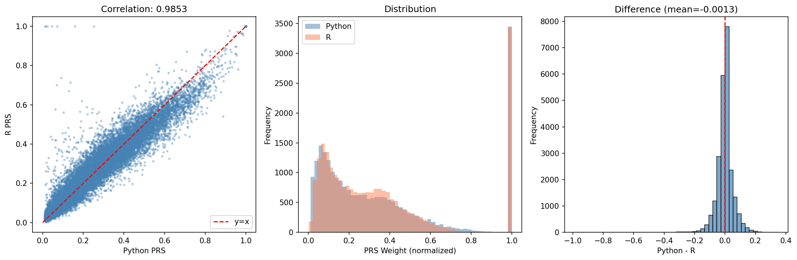
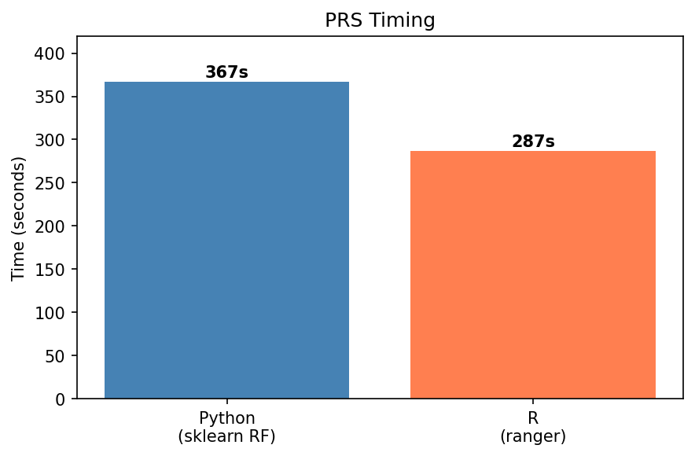

## Visualization Gallery

| Histogram | Bar Chart | Fid/Spe |
|-----------|-----------|---------|
| 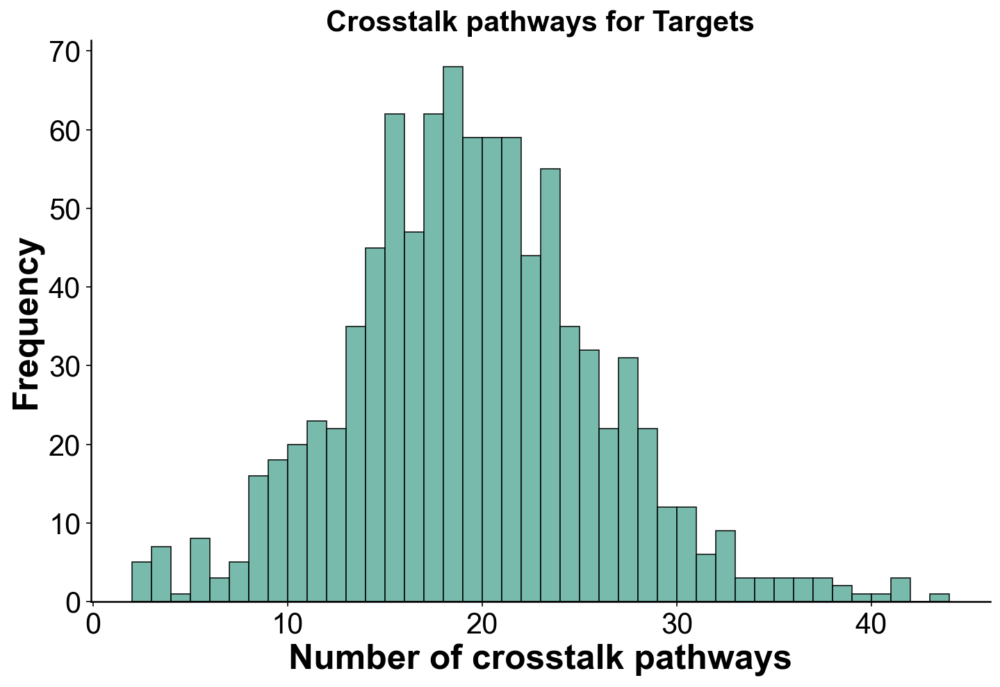 | 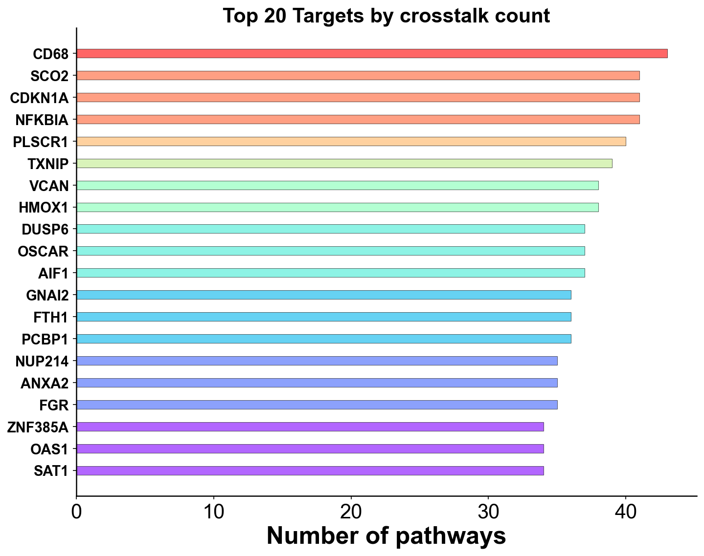 | 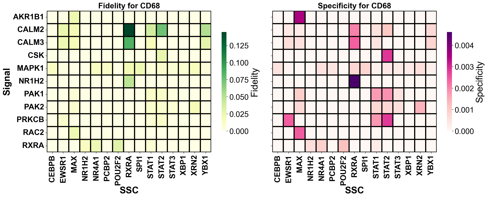 |

| Alluvial | Ridgeline | Chord |
|----------|-----------|-------|
| 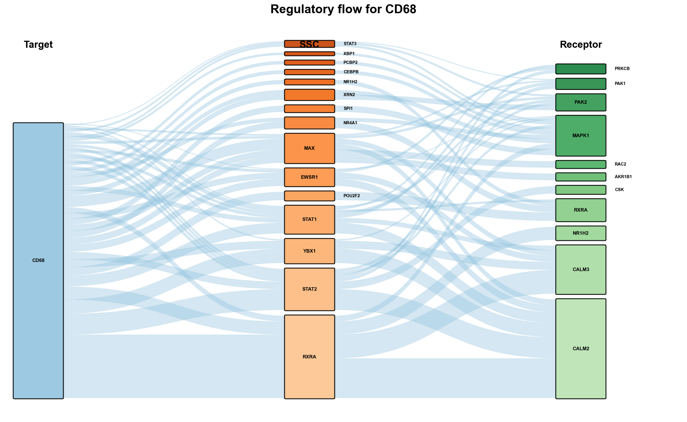 | 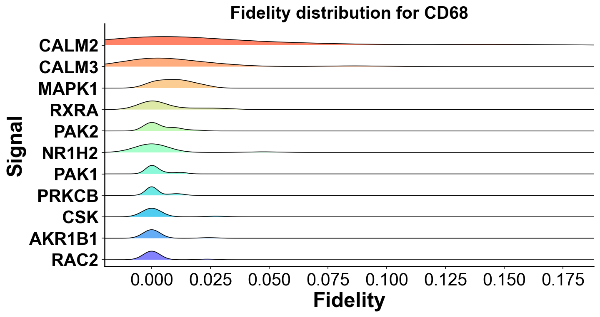 | 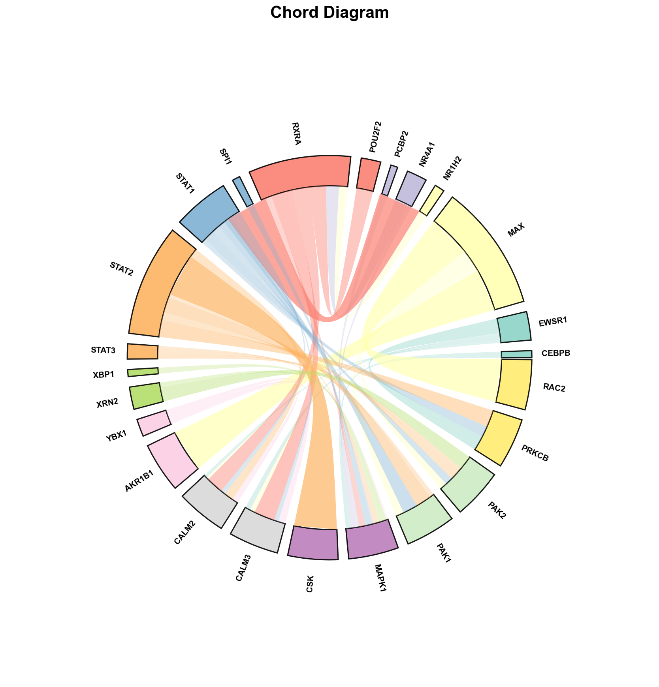 |

| CCI Chord | CCI Circle | Signal Contribution |
|-----------|------------|---------------------|
| 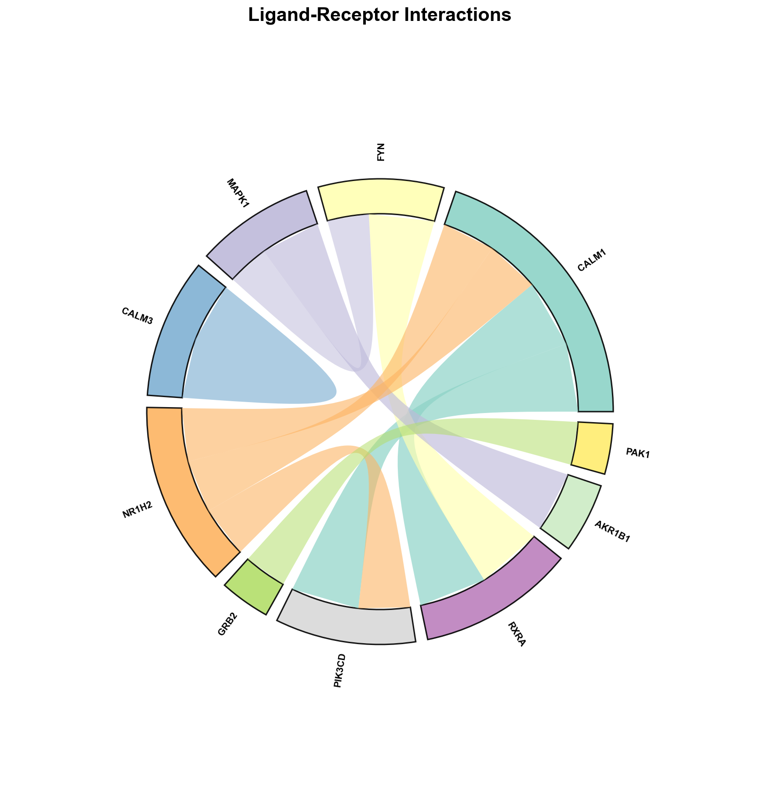 | 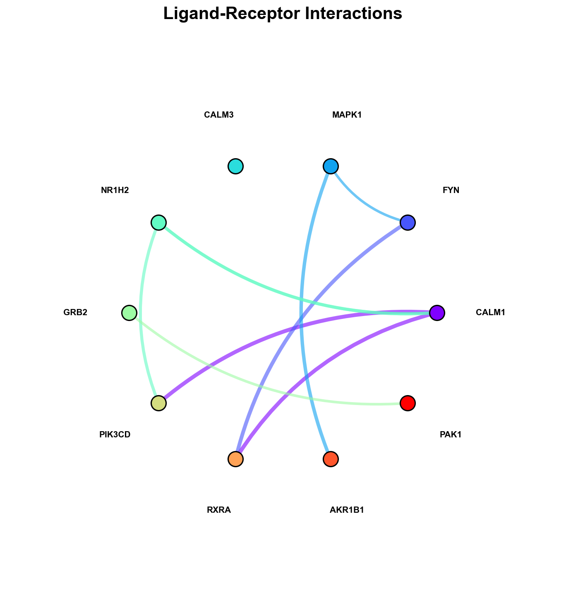 | 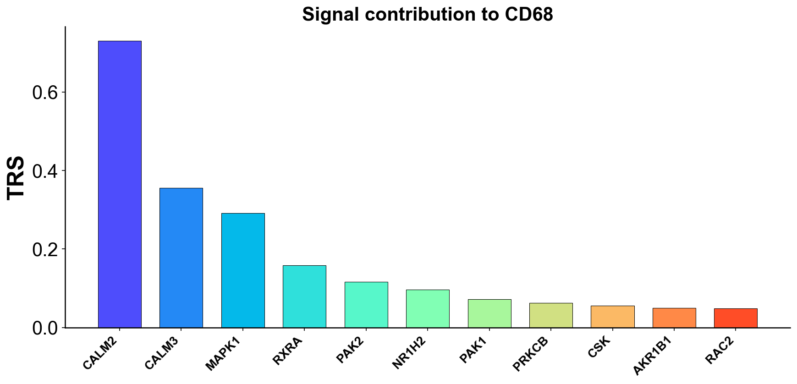 |

| Rec-TG Heatmap | Circular Bar |
|----------------|--------------|
| 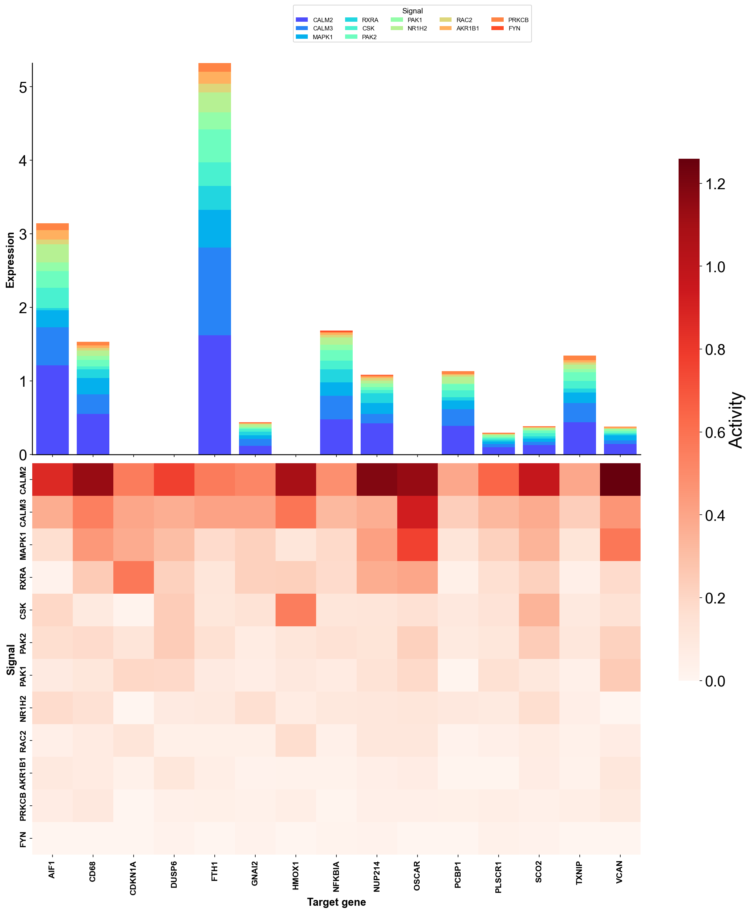 | 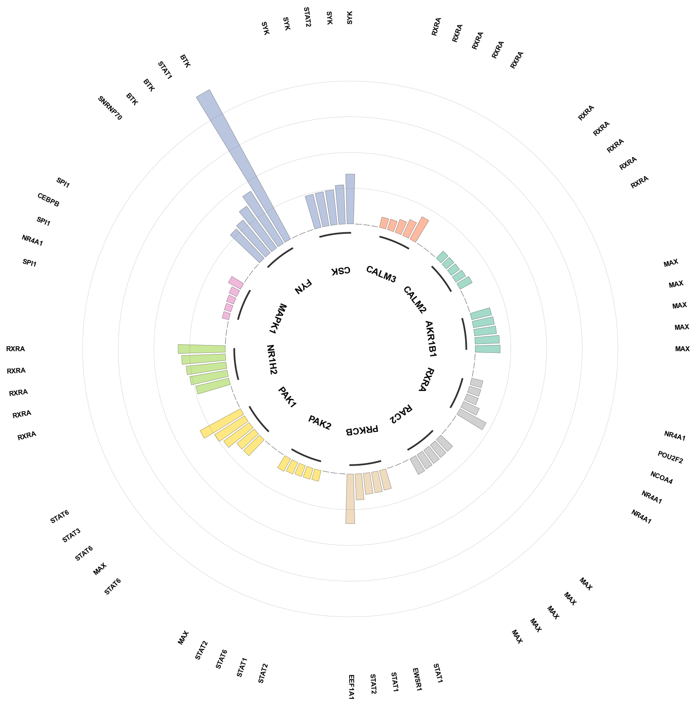 |

## Examples

```
example/
├── quickstart.ipynb              # Full analysis workflow
├── benchmark.ipynb               # Python vs R comparison
├── data/                         # Input data & results
├── figures/                      # Generated figures
└── scripts/                      # Utility scripts
```

## Citation

> Hou, J. et al. Dissecting crosstalk induced by cell-cell communication using single-cell transcriptomic data. Nature Communications (2025).
